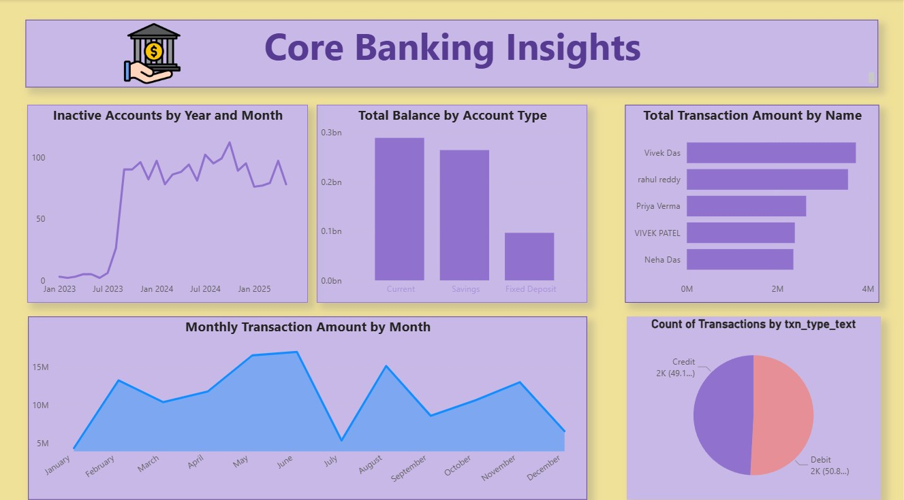
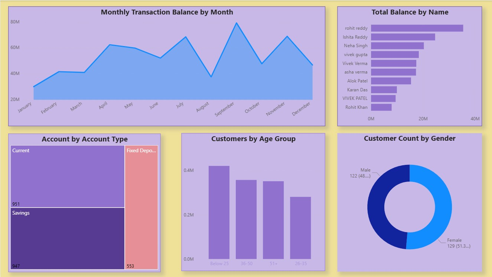

# Core Banking Insights — Power BI Dashboard

**Live Report:** [Open in Power BI](<paste-your-live-report-link-here>)

## Problem statement
A mid-size retail bank lacked a single, trustworthy view of daily transactions, product balances, and customer activity. Leaders struggled to spot trends across debit/credit volumes, monitor inactive accounts, and understand customer mix—relying on scattered Excel extracts that obscured the real picture.

## Solution
I designed and delivered a Power BI dashboard that converts raw banking data into interactive insights—standardizing transaction types, unifying account categories (Current/Savings/Fixed Deposit), and surfacing KPIs like monthly transaction amount, total balance by product, and inactivity patterns for proactive action.

## AIMS Grid
- **Aim:** Enable data-driven decisions on transactions, balances, and customer behavior.  
- **Stakeholders:** Retail banking head, product managers, branch ops, analytics.  
- **End Result:** Self-service pages for **Transactions**, **Accounts & Balances**, **Customers**, and **Inactive Accounts**.  
- **Success Criteria:** Clear trend visibility (monthly amounts), balance distribution by account type, and early detection of inactivity spikes.

## Steps Followed in this project
1. Performed a high-level data review; connected sources to Power BI and profiled fields (transaction type, account type, customer attributes).  
2. Built ETL in Power Query to clean and standardize: Debit/Credit labels, account categories, and date hierarchies for time analysis.  
3. Modeled relationships and created DAX measures for **Monthly Transaction Amount**, **Total Balance**, **Account Counts**, and **Inactive Accounts**.  
4. Designed interactive visuals:
   - Transaction trends (monthly amount & balance) and top customers by transaction amount  
   - Product portfolio view—Total Balance by **Current / Savings / Fixed Deposit** and account counts by type  
   - Customer demographics—gender split and age group distribution  
   - Inactive Accounts tracker with year-month trend  
5. Iterated with stakeholder feedback to refine slicers, drill-downs, and performance.

## Final result
- **Transactions:** Month-over-month debit/credit volumes and amounts with drill-through to customer/account level.  
- **Accounts & Balances:** Portfolio balance by account type and top balance holders.  
- **Customers:** Gender and age distribution to inform targeting.  
- **Inactive Accounts:** Timely visibility into spikes by year/month to trigger outreach.

## Dashboards / Screens

- **Payment and Account Metrics Dashboard**  
  

- **Customer Segments and Portfolio Balances Dashboard**  
  

